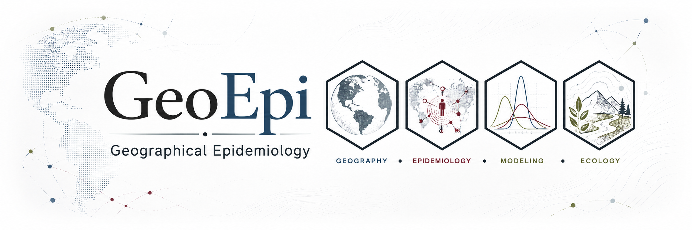

<section class="geoepi-hero" aria-labelledby="hero-title">

GEOGRAPHICAL EPIDEMIOLOGY

<h1 id="hero-title">Disease science across scales.</h1>

GeoEpi studies the ecology, transmission, spread, and management of animal diseases using spatial epidemiology, statistical and mathematical modeling, bioinformatics, simulation, and computational science.

<a class="geoepi-button geoepi-button-primary" href="pindex.qmd">Explore selected research &#8599;</a>
<a class="geoepi-button geoepi-button-secondary" href="about.qmd">About GeoEpi</a>

</section>

<section class="geoepi-section" aria-labelledby="themes-title">

FOUR CONNECTED PERSPECTIVES

<h2 id="themes-title">From molecular signals to landscapes.</h2>

GeoEpi brings complementary scientific perspectives together to understand animal disease systems.

<article class="geoepi-theme-card theme-geography">
01
<h3>Geography</h3>

Spatial structure, movement, landscape processes, and geographic variation.

</article>
<article class="geoepi-theme-card theme-epidemiology">
02
<h3>Epidemiology</h3>

Transmission, outbreak dynamics, surveillance, and population-level disease patterns.

</article>
<article class="geoepi-theme-card theme-modeling">
03
<h3>Modeling</h3>

Statistical, mathematical, simulation, and computational approaches to disease systems.

</article>
<article class="geoepi-theme-card theme-ecology">
04
<h3>Ecology</h3>

Hosts, pathogens, environments, populations, and the ecological processes linking them.

</article>

</section>

<section class="geoepi-section geoepi-explore" aria-labelledby="explore-title">

EXPLORE GEOEPI

<h2 id="explore-title">One group, three ways in.</h2>

PUBLIC SCIENCE
<h3><a class="geoepi-card-link" href="pindex.qmd">Research &#8599;</a></h3>

Selected GeoEpi research projects and public scientific outputs.

CURRENT ACTIVITY
<h3><a class="geoepi-card-link" href="https://geoepi.github.io/geoepi-hub/">GeoEpi Hub &#8599;</a></h3>

Current projects, analytical subprojects, milestones, and portfolio state.

WORKING PRACTICES
<h3><a class="geoepi-card-link" href="https://geoepi.github.io/geoepi-notebook/">GeoEpi Lab Book &#8599;</a></h3>

Practical guidance describing how GeoEpi organizes and conducts reproducible work.

</section>

