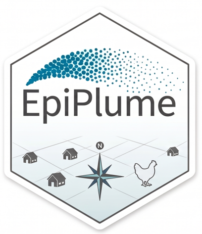
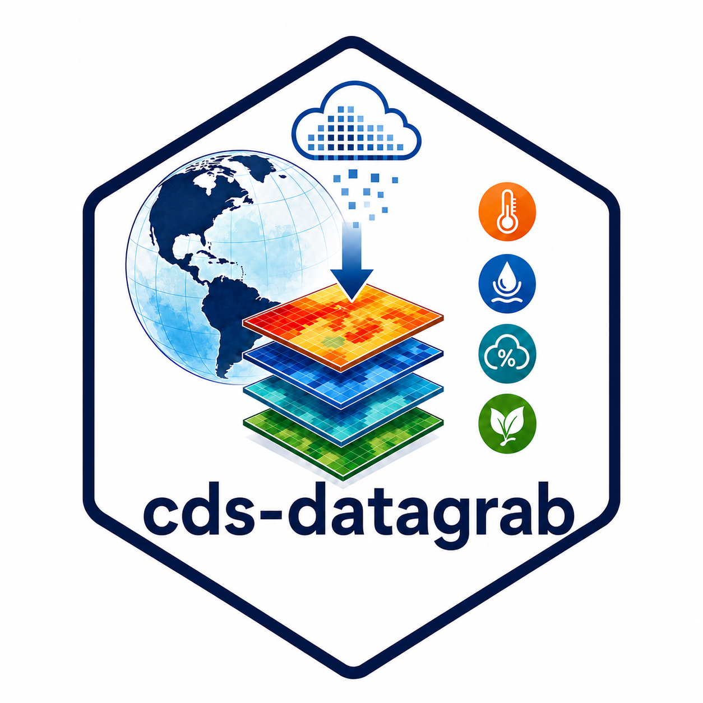

COMPUTATIONAL PRODUCTS

GeoEpi develops reusable software, computational workflows, simulation frameworks, data pipelines, and interactive applications in support of animal-disease research. Some resources are general-purpose analytical tools, while others were developed for specific scientific problems but may be useful or adaptable beyond their original projects.

<article class="geoepi-software-card">

Interactive application
<h2>VSV Dashboard</h2>

An interactive dashboard for exploring vesicular stomatitis transmission dynamics and related epidemic behavior.

<ul class="geoepi-software-actions">
<li><a href="https://geoepi.shinyapps.io/seir-vector/">Launch application &#8599;</a></li>
</ul>

</article>

<article class="geoepi-software-card">

R package / workflow toolkit
<h2>bcapture</h2>

Tools for extracting, organizing, validating, summarizing, and viewing data from Biosecurity Compliance Audit Program (bCAP) forms.

<ul class="geoepi-software-actions">
<li><a href="https://github.com/geoepi/bcapture">Repository &#8599;</a></li>
</ul>

</article>

<article class="geoepi-software-card">

Modeling framework / workflow
<h2>EpiPlume</h2>

Exploratory models of pathogen movement via aerosol, particle, and airborne dispersion, with workflow demonstrations for plume and trajectory analysis.

<ul class="geoepi-software-actions">
<li><a href="https://github.com/geoepi/EpiPlume">Repository &#8599;</a></li>
<li><a href="https://geoepi.github.io/EpiPlume/">Documentation &#8599;</a></li>
</ul>

</article>

<article class="geoepi-software-card">

R package
<h2>sequencemap</h2>

Converts aligned viral sequences and sampling coordinates into PCA, DAPC, and location-level summaries, with optional spatial prediction of ordination-axis scores.

<ul class="geoepi-software-actions">
<li><a href="https://github.com/geoepi/sequence-map">Repository &#8599;</a></li>
</ul>

</article>

<article class="geoepi-software-card">

R package / simulation framework
<h2>challengeABM</h2>

An agent-based modeling framework simulating within-host dynamics, room-to-room animal experiments, within-herd host transmission, and between-farm spread.

<ul class="geoepi-software-actions">
<li><a href="https://github.com/geoepi/challengeABM">Repository &#8599;</a></li>
<li><a href="https://geoepi.shinyapps.io/fmdv-preclinical/">Shiny demonstration &#8599;</a></li>
</ul>

</article>

<article class="geoepi-software-card">

R package
<h2>traverse</h2>

Estimates randomized passage and connectivity across gridded landscapes and returns passage intensity summarizing many possible routes rather than a single least-cost path.

<ul class="geoepi-software-actions">
<li><a href="https://github.com/geoepi/traverse">Repository &#8599;</a></li>
</ul>

</article>

<article class="geoepi-software-card">

Data pipeline / reproducible workflow
<h2>cds-datagrab</h2>

A reproducible R-package workflow for retrieving environmental data from the Copernicus Climate Data Store, aligning source data, writing daily GeoTIFFs, and aggregating complete ISO weeks.

<ul class="geoepi-software-actions">
<li><a href="https://github.com/geoepi/cds-datagrab">Repository &#8599;</a></li>
</ul>

</article>

